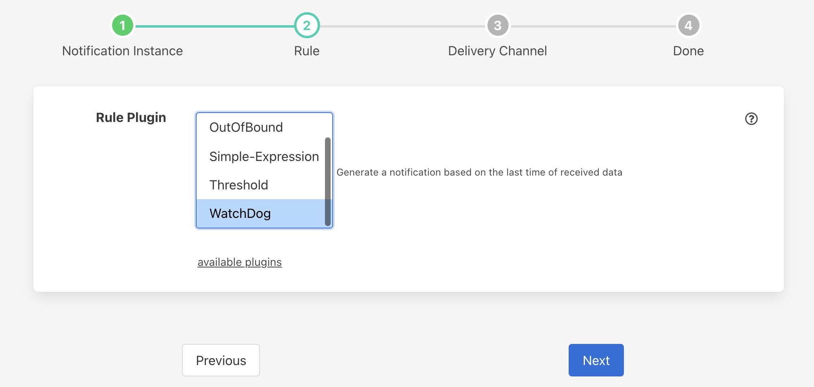
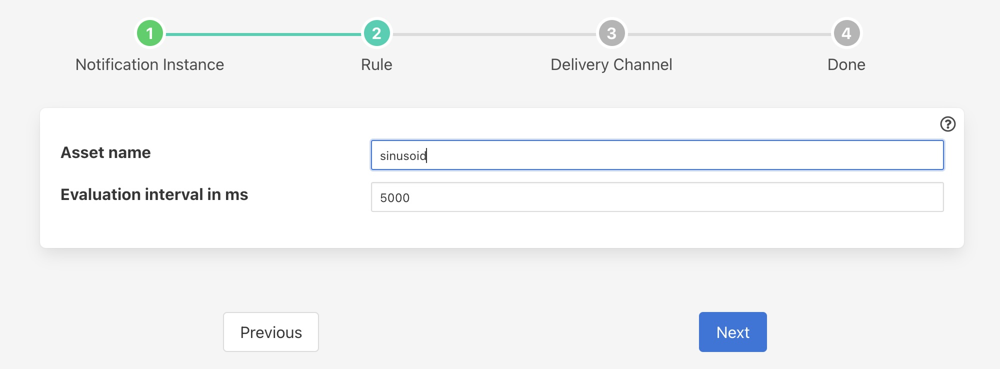

.. Images

Watchdog Rule
=============

The *fledge-rule-watchdog* is a notification rule plugin that is to detect the absence of data. The plugin is simply configured with the name of an asset to track and a period to test over. If no new readings are observed within that specified period of time then the rule will trigger.

During configuration of the notification choose the WatchDog rule from the set of available rules.

+--------------+
| |watchdog_1| |
+--------------+

The next step in the process is to enter the configuration options for the watchdog rule.

+--------------+
| |watchdog_2| |
+--------------+

  - **Asset name**: The name of the asset to track.

  - **Evaluation interval in ms**: The period of time to monitor for new readings of the asset. This is expressed in milliseconds.

As soon as the configured time period expires, if no readings for the asset have been observed then the rule will trigger.

It is important to consider the tuning of the south service buffering when setting up watchdog plugins. The watchdog is based on data entering the Fledge buffer, hence if the south service buffers data for a period that is the same or close to the watchdog period then false triggering of the watchdog may occur. Ensure the south service maximum latency is less than the watchdog interval for reliable behavior.
