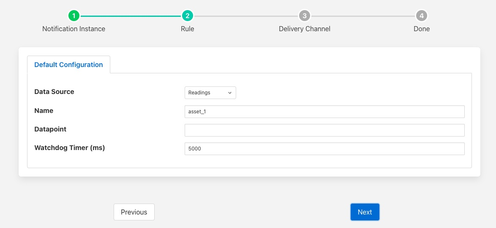

.. Images

Watchdog Rule
=============

The *fledge-rule-watchdog* is a notification rule plugin that is to detect the absence of data. The plugin is simply configured with the name of an asset to track and a period to test over. If no new readings are observed within that specified period of time then the rule will trigger.

During configuration of the notification choose the WatchDog rule from the set of available rules.

+--------------+
| |watchdog_1| |
+--------------+

The next step in the process is to enter the configuration options for the watchdog rule.

+--------------+
| |watchdog_2| |
+--------------+

  - **Data Source**: The source of the data to send to the watchdog rule

    +--------------+
    | |watchdog_3| |
    +--------------+

    - *Readings*: The source of the data sent to the watchdog rule will be the readings ingested from the south services.

    - *Statistics*: The source of the data will be the raw statistics values. The *Name* configured should be the name of a statistic.

    - *Statistics Rate*: The source of the data will be the statistics rate. Note these are only updated every 15 seconds, so the watchdog timer that is set must be greater than 15 seconds. The *Name* configured should be the name of a statistic.

    - *Audit*: The source of the data sent to the rule will be the Audit log.  The *Name* configured should be an audit code.

  - **Name**: The name of the asset, statistic or audit code to monitor.

  - **Datapoint**: The name of a datapoitn that must exist in an asset. If this is left blank then no specific datapoint is checked within the asset.

  - **Watchdog Timer (ms)**: The period of time to monitor for new readings of the asset, statistic or audit code. This is expressed in milliseconds. If no matchign data is seen witin this time then the rule will be triggered.

It is important to consider the tuning of the south service buffering when setting up watchdog plugins. The watchdog is based on data entering the Fledge buffer, hence if the south service buffers data for a period that is the same or close to the watchdog period then false triggering of the watchdog may occur. Ensure the south service maximum latency is less than the watchdog interval for reliable behavior.
